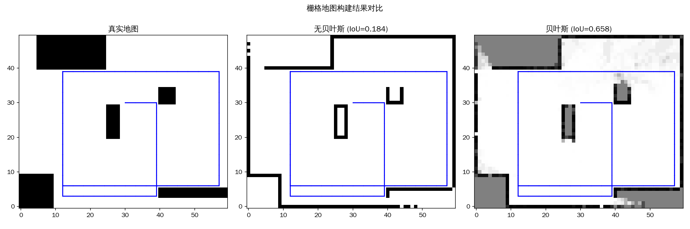
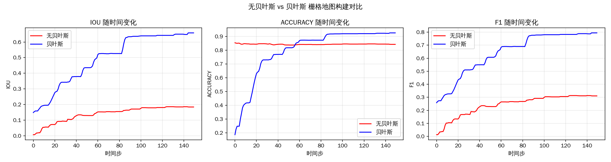

# 栅格地图构建方法对比实验分析报告

## 1. 实验背景

### 1.1 研究目的

本实验旨在对比分析两种栅格地图构建方法的性能差异：
- **无贝叶斯方法**：基于激光射线终点直接累加的简单方法
- **贝叶斯方法**：基于逆扫描模型和对数几率更新的概率方法

### 1.2 应用场景

栅格地图构建是移动机器人导航和SLAM（同步定位与建图）的核心技术之一。本实验模拟移动机器人在未知环境中使用2D激光雷达进行环境感知和地图构建的过程。

---

## 2. 方法概述

### 2.1 无贝叶斯方法

**核心思想**：将每条激光射线的终点直接映射到栅格地图中，通过计数累加来标记障碍物位置。

**算法步骤**：
1. 射线投射：模拟激光雷达扫描，获取各方向的距离测量值
2. 终点累加：将每条射线的终点坐标映射到栅格，计数加1
3. 二值化：设置阈值，将计数地图转换为二值占用图

**公式表示**：
$$
\text{count}(m_i) = \sum_{t=1}^{T} \mathbf{1}[m_i = \text{endpoint}(\text{ray}_t)]
$$

$$
\text{occupancy}(m_i) = \begin{cases} 1 & \text{if count}(m_i) \geq \tau \\ 0 & \text{otherwise} \end{cases}
$$

**特点**：
- ✅ 实现简单，计算效率高
- ❌ 只处理终点，忽略空闲区域信息
- ❌ 无法区分真实障碍与噪声
- ❌ 缺乏不确定性表示

### 2.2 贝叶斯方法

**核心思想**：使用逆扫描测量模型将距离测量转换为占用概率，通过贝叶斯更新迭代融合多帧观测。

**算法步骤**：
1. 逆扫描模型：根据距离测量计算每个栅格的占用概率
2. 对数几率更新：将对数几率形式融合观测信息
3. 概率转换：从对数几率恢复占用概率

**公式表示**：

逆扫描模型将空间划分为三区域：
$$
p(m_i | z_t) = \begin{cases}
0.5 & \text{未知区域（超出测量范围或视野外）} \\
0.7 & \text{占用区域（在测量终点附近）} \\
0.3 & \text{空闲区域（在测量终点之前）}
\end{cases}
$$

对数几率更新：
$$
L_t(m_i) = L_{t-1}(m_i) + \log\frac{p(m_i|z_t)}{1-p(m_i|z_t)} - L_0
$$

概率恢复：
$$
p(m_i) = \frac{e^{L(m_i)}}{1 + e^{L(m_i)}}
$$

**特点**：
- ✅ 同时处理占用和空闲区域
- ✅ 概率表示支持不确定性建模
- ✅ 多观测融合提高鲁棒性
- ❌ 计算复杂度较高

---

## 3. 实验设置

### 3.1 仿真环境

| 参数 | 值 |
|------|-----|
| 地图尺寸 | 50 × 60 栅格 |
| 仿真时长 | 150 时间步 |
| 激光视场角 | ±0.4 rad |
| 激光角分辨率 | 0.05 rad |
| 最大量程 | 30 栅格单位 |
| 机器人初始位置 | (30, 30, 0) |

### 3.2 障碍物分布

```
真实地图中的障碍物区域：
- 区域1: [0:10, 0:10]    (左上角)
- 区域2: [30:35, 40:45]  (右侧中部)
- 区域3: [3:6, 40:60]    (顶部条状)
- 区域4: [20:30, 25:29]  (中部方形)
- 区域5: [40:50, 5:25]   (底部矩形)
```

### 3.3 机器人运动

机器人采用"碰到边界或障碍后转向"的运动策略：
- 线速度控制序列：[(3,0), (0,3), (-3,0), (0,-3)] 循环
- 角速度：0.3 rad/时间步
- 碰撞检测：遇边界或障碍时保持静止并转向

### 3.4 评估指标

| 指标 | 公式 | 含义 |
|------|------|------|
| **Accuracy** | (TP+TN)/(TP+TN+FP+FN) | 整体准确率 |
| **Precision** | TP/(TP+FP) | 预测为障碍中真实的比例 |
| **Recall** | TP/(TP+FN) | 真实障碍被检出的比例 |
| **IoU** | TP/(TP+FP+FN) | 交并比 |
| **F1-Score** | 2×P×R/(P+R) | 精确率和召回率的调和平均 |

---

## 4. 实验结果

### 4.1 最终性能对比

| 指标 | 无贝叶斯 | 贝叶斯 | 提升幅度 |
|------|----------|--------|----------|
| **Accuracy** | 0.8433 | **0.9267** | +8.33% |
| **Precision** | 0.4125 | **0.6594** | +24.70% |
| **Recall** | 0.2494 | **0.9976** | +74.82% |
| **IoU** | 0.1840 | **0.6584** | +47.44% |
| **F1-Score** | 0.3109 | **0.7940** | +48.32% |

### 4.2 混淆矩阵对比

| | 无贝叶斯 | 贝叶斯 |
|---|---------|--------|
| **TP (真正例)** | 106 | 425 |
| **TN (真负例)** | 2424 | 2222 |
| **FP (假正例)** | 151 | 353 |
| **FN (假负例)** | 319 | 0 |

### 4.3 地图可视化对比



**观察要点**：
- 左图：真实地图（5个障碍物区域）
- 中图：无贝叶斯方法结果，仅部分障碍被检测，大量漏检
- 右图：贝叶斯方法结果，几乎所有障碍被正确识别

### 4.4 指标随时间演变



**关键观察**：
- **IoU曲线**：贝叶斯方法快速收敛至0.6以上，无贝叶斯方法停滞在0.18左右
- **准确率**：贝叶斯方法稳定在0.92以上，无贝叶斯约0.84
- **F1-Score**：贝叶斯方法持续提升，最终达到0.79；无贝叶斯仅0.31

---

## 5. 结果分析

### 5.1 检出率差异分析（Recall）

无贝叶斯方法的Recall仅为**0.2494**，贝叶斯方法高达**0.9976**，差异的主要原因：

**无贝叶斯方法局限**：
1. **单点检测**：仅在激光终点累加计数，无法覆盖障碍物内部区域
2. **覆盖不完整**：机器人轨迹未完全覆盖所有障碍物，导致部分区域无观测
3. **阈值敏感**：阈值设为1导致噪声干扰，设为更高阈值则漏检更严重

**贝叶斯方法优势**：
1. **区域扩散**：逆扫描模型中α参数(=1)使障碍概率向相邻栅格扩散
2. **空闲标记**：空闲区域概率降低，间接提高障碍区域的相对置信度
3. **融合累积**：每次观测都累积证据，即使位置稍有偏差也能正确融合

### 5.2 精确率差异分析（Precision）

无贝叶斯Precision为**0.4125**，贝叶斯为**0.6594**。

**无贝叶斯假正例来源**：
- 激光末端的随机噪声点
- 机器人短暂停留时同一位置多次重复累加

**贝叶斯假正例来源**：
- 空闲区域与障碍物边界的模糊区域
- 当α较大时，障碍概率扩散到真实障碍外

### 5.3 IoU显著差异分析

无贝叶斯IoU仅**0.184**，贝叶斯达到**0.658**。

**IoU定义**：
$$
\text{IoU} = \frac{TP}{TP + FP + FN}
$$

**关键因素**：
- 无贝叶斯的FN（假负例）高达319，占总障碍数的75%
- 贝叶斯FN为0，几乎所有障碍物被检测

### 5.4 空闲区域处理对比

| 特性 | 无贝叶斯 | 贝叶斯 |
|------|----------|--------|
| 空闲区域识别 | ❌ 不支持 | ✅ 概率为0.3 |
| 不确定区域 | ❌ 默认为空闲 | ✅ 概率为0.5 |
| 障碍物更新 | 仅终点累加 | 逆模型全区域计算 |

**影响**：
- 无贝叶斯无法区分"未观测"和"空闲"
- 贝叶斯明确标记已观测空闲区域，提高地图可信度

---

## 6. 理论分析

### 6.1 信息利用效率

**无贝叶斯**：仅利用激光射线的终点信息（1个点/射线）

$$
I_{\text{无贝叶斯}} = N_{\text{rays}} \times 1 \text{ 点}
$$

**贝叶斯**：利用整条射线的空间信息（所有经过的栅格）

$$
I_{\text{贝叶斯}} = N_{\text{rays}} \times \bar{r} \text{ 栅格}
$$

其中 $\bar{r} \approx r_{\max}/2$ 为平均射程。

### 6.2 不确定性建模

**无贝叶斯**：确定性输出（0或1）

- 无法量化置信度
- 难以处理矛盾观测

**贝叶斯**：概率输出（0~1连续值）

- 对数几率可累加合并多观测
- 先验（0.5）提供初始不确定性估计

### 6.3 计算复杂度

| 方法 | 单帧复杂度 | 空间复杂度 |
|------|-----------|-----------|
| 无贝叶斯 | O(N_rays) | O(M×N) |
| 贝叶斯 | O(M×N×N_rays) | O(M×N) |

贝叶斯方法的逆扫描模型需要遍历所有栅格，计算量较大。

---

## 7. 结论与建议

### 7.1 主要结论

1. **贝叶斯方法显著优于无贝叶斯方法**：IoU提升47.44个百分点
2. **检出率差距最大**：Recall差异达74.82%
3. **空闲区域处理是关键**：贝叶斯方法的空闲区域标记大幅提升性能
4. **时间效率：贝叶斯方法收敛快**，约30步后IoU即超过0.5

### 7.2 方法选择建议

| 场景 | 推荐方法 | 理由 |
|------|----------|------|
| 实时性要求极高 | 无贝叶斯 | 计算简单快速 |
| 精度要求高 | 贝叶斯 | IoU/F1显著更高 |
| 环境动态变化 | 贝叶斯 | 概率更新支持遗忘 |
| 大规模建图 | 混合方法 | 贝叶斯+局部更新 |

### 7.3 后续工作

1. **KITTI真实数据验证**：在真实激光雷达数据上验证方法泛化性
2. **参数敏感性分析**：研究α、β、阈值对性能的影响
3. **增量式建图**：优化贝叶斯方法，仅更新观测区域
4. **多传感器融合**：结合里程计、IMU提高定位精度

---

## 8. 附录

### 8.1 代码文件

| 文件 | 说明 |
|------|------|
| `grid_mapping_baseline.py` | 无贝叶斯方法实现 |
| `occupancy_grid_mapping.py` | 贝叶斯方法实现 |
| `grid_mapping_comparison.py` | 对比实验脚本 |

### 8.2 结果文件

| 文件 | 说明 |
|------|------|
| `results/map/occupancy_map_animation.mp4` | 无贝叶斯动画 |
| `results/comparison/bayes_belief_animation.mp4` | 贝叶斯动画 |
| `results/comparison/metrics_comparison.png` | 指标曲线图 |
| `results/comparison/map_comparison.png` | 地图对比图 |

---

*报告生成时间：2026-04-20*
